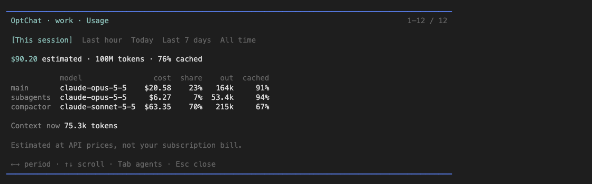

# pi-optchat

A Pi extension that implements [Victor Taelin's OptChat recipe](https://gist.github.com/VictorTaelin/91837951a5ce5b38f341ec1ba1df6449): one endless chat per profile, remembered through a summary tree instead of compaction.

This is a fork of [jonaslsaa/pi-optchat](https://github.com/jonaslsaa/pi-optchat). It merges upstream's changes but follows the recipe more closely, and it is built for one Pi window that stays open and delegates to every project.

- **Memory**: every message is logged and summarized into a binary tree. Each turn starts from a fresh context that holds a bounded memory view and your new message. The agent reads the original messages with `zoom` and `date`.
- **Profiles**: separate memories and instructions, such as `work` and `personal`.
- **Subagents**: the main agent delegates tasks to background agents in any directory. You can watch them live and send them guidance.
- **Import**: bring in history from Claude Code (conversations and memories), Codex, or ChatGPT.

## How this fork differs from upstream

| | This fork | Upstream |
|---|---|---|
| A turn's context | The memory view and your new message, as the recipe prescribes. The agent zooms when it needs earlier wording | The memory view plus the last exchange, with no size bound |
| Subagents | Only the main agent delegates, and one spawn sends one report with all its results | Subagents can delegate two more levels, and each reports when it finishes |
| Windows | One Pi window per profile. A new session on a busy profile offers only **Back** | A second window connects as a subagent, with `/tell-main` and `/complete` |

[FORK.md](FORK.md) lists every difference, including summary size, OpenAI caching, and import.

## Install

```sh
pi install git:github.com/aaaxn/pi-optchat
pi install npm:pi-web-access   # optional, for web search and page fetching
```

`pi install npm:pi-optchat` installs upstream, not this fork.

Requirements: Pi 1.0.2 or compatible, Node.js 22.19+, and Git.

Subagents load the Pi extensions you have installed, so `pi-web-access` gives web tools to the main agent and every subagent.

To uninstall, run `pi remove git:github.com/aaaxn/pi-optchat`. Profile data is kept.

## Quick start

1. Restart Pi.
2. Choose **+ Create profile** and name it, for example `work`.
3. Chat normally.

The footer shows the active profile. Memory follows the profile across directories and Pi sessions. A new session shows the profile picker with the last-used profile first. A resumed session restores its profile. For headless use, pass `--optchat-profile work`.

Profiles separate memory and instructions only. Every agent keeps full filesystem access and uses the same provider logins.

## Commands

| Command | Action |
| --- | --- |
| `/optchat` | Status and actions menu |
| `/optchat profile` | Select or create a profile. Switching starts a fresh Pi session |
| `/optchat model` | Compactor model and effort for this profile |
| `/optchat agents` | Live agent list and saved run history |
| `/optchat agents model` | Subagent model and effort for this profile |
| `/optchat usage` | Token usage and cost estimates |
| `/optchat instructions` | Edit this profile's `AGENTS.md` |
| `/optchat browse` | Open a readable snapshot of memory, from the view down to the original messages, with search |
| `/optchat import` | Import history, or resume or discard a paused import |

Agents get Pi's usual global and repository `AGENTS.md` files and your skills, then the profile's `AGENTS.md`.

## Models

| Role | Default | Change with |
| --- | --- | --- |
| Main agent | Whatever is selected in Pi | `/model` |
| Subagents | Anthropic Opus 5.5, high | `/optchat agents model` |
| Compactor (summaries, imports) | Anthropic Sonnet 5.5, medium | `/optchat model` |

Subagent and compactor settings are saved per profile and do not follow the main model. If you have no Anthropic login, change both before chatting. The compactor and subagents make extra requests with your provider credentials.

## Subagents

Ask in plain words, for example: "Spawn an agent to investigate this repository and report back."

- `spawn` starts one subagent per task, each in its task's `cwd` (default: the main chat's directory). Pi loads the `AGENTS.md` files of that directory, so one main chat can work on any project without being opened there.
- A subagent gets the memory view as it was at launch, the profile's instructions, read-only `zoom` and `date`, normal coding tools, your installed extensions, and the MCP servers the main session loaded.
- When all of one spawn's subagents finish, their reports reach the main agent as one message. Put independent work in separate spawns. The main agent never polls.
- The main agent sends guidance to a running subagent with `tell`. A subagent reaches the main agent mid-run with `tell_parent`.
- `tell` to a finished subagent resumes it from its saved transcript, even one from an earlier Pi session.
- At most 8 agents run per profile. Over the limit, `spawn` returns an error; there is no queue.
- Agents run inside the Pi process. Closing Pi stops them.
- Agents share the filesystem. When parallel agents edit one repository, give each its own git worktree.

## Agents and usage inspector

An **Agents | Usage** bar sits below the input. Press **Down** on an empty input, or **F6**, to open it. Set another shortcut with `OPTCHAT_INSPECT_KEY=ctrl+shift+a pi`.

**Agents** lists each run with its state, elapsed time, current tool, and last activity. Press **M** to pick the subagent model. **Enter** opens that agent's conversation, drawn like the main chat and following live output. While the agent runs, type and press **Enter** to send it guidance. Press **Ctrl+X** twice to stop it and **Escape** to go back.

**Usage** shows cost estimates for this session, the last hour, today, the last 7 days, or all time, with one row per role and model. Costs are API prices, not your subscription bill.



## Import history

Pick the destination profile, then run `/optchat import`.

1. **Source**: Claude Code (`~/.claude/projects`), Claude Code memories, Codex (`~/.codex/sessions`, `~/.codex/archived_sessions`), or a ChatGPT export (ZIP, folder, or `conversations.json`; ZIP needs `unzip`). Scanning is local and makes no model calls.
2. **Select**: pick projects, optionally filter by start date, then take all conversations or pick some. **Tab** toggles, **Enter** continues, and typing filters.
3. **Mode**, if the profile already has history: **Append** adds the import to the existing summaries. **Rebuild** regenerates the whole tree in conversation start order.
4. **Preview**: new and duplicate counts and a rough token estimate before anything runs.

An import keeps your messages and the final assistant replies, with their original dates, and marks them as historical. It drops tool calls, reasoning, and attachment bytes. Each Claude Code memory file becomes a dated note in the tree. Re-importing skips messages already present.

An import builds a new memory generation and switches to it only when the whole tree is ready. The previous generation stays on disk, and source files are never modified. Pause with **Escape** or by restarting Pi. `/optchat import` then offers to resume or discard. While an import is pending, that profile cannot chat.

## Storage

Profile data lives in `~/.optchat/profiles/<name>/`. Set `OPTCHAT_HOME` to move the root.

| Path | Contents |
| --- | --- |
| `main/` | The conversation log, as dated JSONL |
| `tree/` | Summary nodes |
| `active-memory.json`, `memories/<id>/` | After an import: which generation is active, and the generations |
| `AGENTS.md`, `config.json` | Profile instructions, and the compactor and subagent models |
| `runs/` | Subagent sessions |
| `usage.jsonl` | Usage ledger |

Each profile folder is a local Git repository, committed after each turn and on clean shutdown. Everything is committed except `runs/`, `memory.html`, and `usage.jsonl`. It has no remote, so it is not a backup. To back up, copy the folder while Pi is closed. To delete a profile, delete its folder.

## Development

```sh
git clone https://github.com/aaaxn/pi-optchat.git
cd pi-optchat
npm ci --ignore-scripts
pi install .
```

Restart Pi after source changes. [AGENTS.md](AGENTS.md) holds the development rules, the recipe's constraints, and how to merge upstream.

```sh
npm run check      # type check and lint
npm test           # offline tests, no paid model calls
npm run test:live  # paid Anthropic calls on synthetic data in a disposable profile
```

## Credits and license

Based on [Victor Taelin's OptChat recipe](https://gist.github.com/VictorTaelin/91837951a5ce5b38f341ec1ba1df6449) and [OptMem](https://github.com/VictorTaelin/OptMem), and forked from [jonaslsaa/pi-optchat](https://github.com/jonaslsaa/pi-optchat). This is an independent Pi implementation, not Victor's official OptChat.

MIT licensed. See [LICENSE](LICENSE) and [third-party notices](THIRD_PARTY_NOTICES.md).
